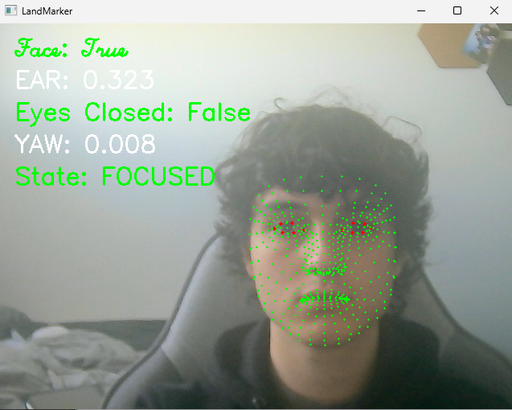
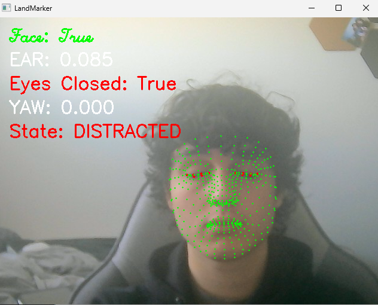
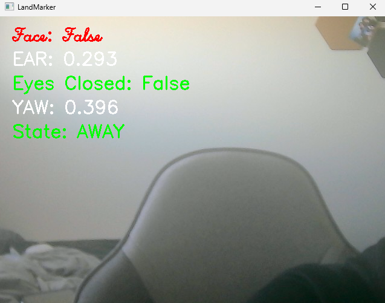

# Real-Time Attention Detection System

## Overview
This project implements a real-time **Attention Detection System** in Python that classifies a user’s state as **Focused**, **Distracted**, or **Away** using a live webcam feed. The system combines computer vision, geometric facial analysis, and temporal logic to model attention as a continuous behavior rather than a single-frame prediction.

The project is designed to be interpretable, modular, and efficient, emphasizing **clear reasoning and system design** over black-box machine learning.

---

## Key Features
- Real-time face detection and facial landmark extraction using **MediaPipe Tasks**
- **Eye Aspect Ratio (EAR)**–based eye-closure detection using Euclidean geometry
- Head direction estimation via a normalized yaw proxy derived from facial symmetry
- Temporal logic to prevent false positives from blinks or brief glances
- Live on-screen HUD displaying attention state and diagnostic metrics
- Event-based logging to CSV for offline analysis
- Optional audible alert for prolonged distraction
- Clean, modular architecture (perception → features → decision → UI → logging)

---

## Attention Logic
IF no face detected → AWAY
ELSE IF eyes closed > 2 seconds → DISTRACTED
ELSE IF head turned > 3 seconds → DISTRACTED
ELSE → FOCUSED


All thresholds are configurable and easily tunable.

---

## Tech Stack
- Python
- OpenCV
- MediaPipe Tasks
- NumPy

---

## Project Structure
AttentionDetection/
├─ src/
│ ├─ main.py
│ ├─ camera.py
│ ├─ features.py
│ ├─ logger.py
│ ├─ event_logger.py
├─ blaze_face_short_range.tflite
├─ face_landmarker.task
│
├─ Notes/
|  ├─ Attention Detection.pdf
|
├─ assets/ # Screenshots / demo media
├─ requirements.txt
├─ README.md


---
## Demo
### Focused State


### Distracted State


### Away State


## Documentation
Detailed design explanations, geometric derivations (EAR, yaw proxy), and system decisions are provided in the /Notes directory.
Walks through my process of design. Important to read.

## How to Run
Run the system by runnning main.py from AttentionDetection Directory and press q to exit
python src/main.py

### Requirements
- Python 3.9+
- Webcam

### Installation
```bash
pip install -r requirements.txt

---


